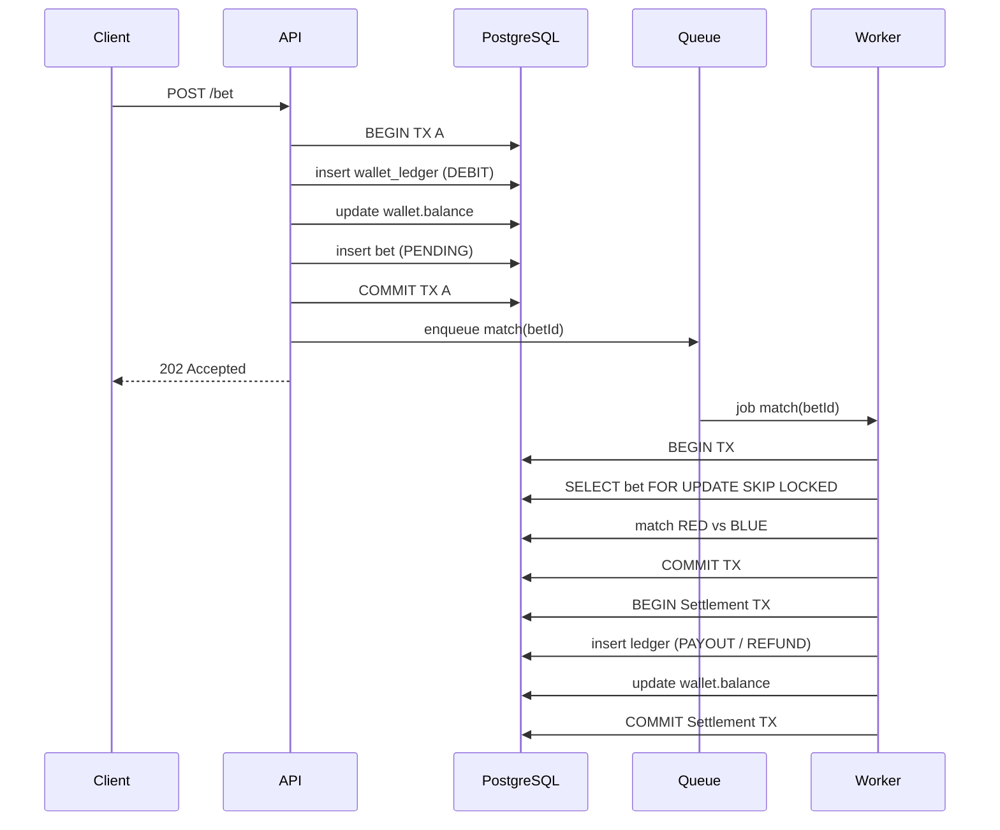
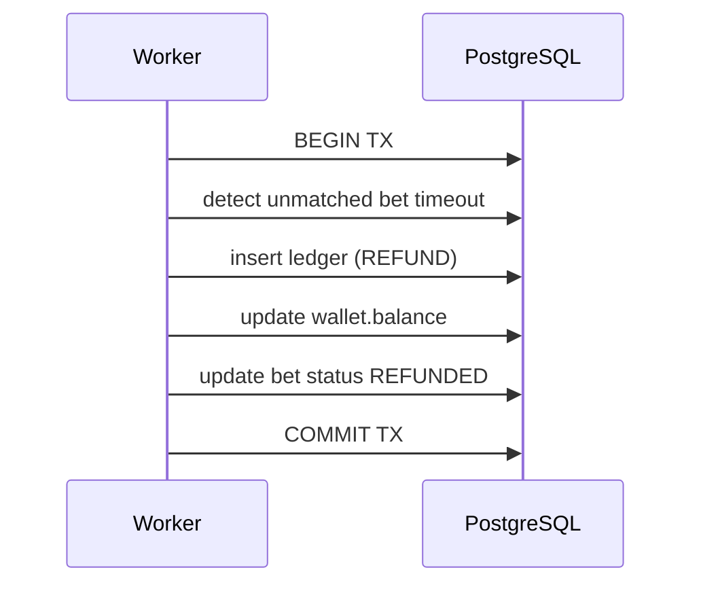

Rất hay 👍
Câu hỏi này đúng kiểu **tư duy Senior/Staff backend**: *“Còn kiến trúc nào phức tạp & thực tế hơn không? Và hiểu bản chất DB + sequence thực sự chạy thế nào?”*
Mình trả lời theo **3 tầng nâng cao**, rồi **giải thích INDEX từ gốc**, cuối cùng **vẽ SEQUENCE DIAGRAM chuẩn production**.

---

# I️⃣ KIẾN TRÚC NÂNG CAO & PHỨC TẠP HƠN (THỰC TẾ)

## 🔥 Level 1 – Queue + Worker (bạn đang dùng)

✅ Phù hợp: 500–2k users
✅ Đã tách money & auto-match
✅ Dễ triển khai

---

## 🔥 Level 2 – Event-Driven + Saga Pattern (PRO)

```text
Client
 ↓
API (Command)
 ↓
DB (append ledger)
 ↓
Outbox Table
 ↓
Event Dispatcher
 ↓
Match Service
 ↓
Settlement Service
```

### Vì sao nâng cao hơn?

* Không gọi queue trực tiếp
* DB commit → event được phát **chắc chắn**
* Không mất job khi API crash

📌 **Outbox Pattern**

* Event được lưu cùng transaction
* Worker đọc từ DB → publish Redis/Kafka

✅ Chống:

* Lost message
* Double event

---

## 🔥 Level 3 – Ledger-First Architecture (FINTECH / EXCHANGE)

```text
Wallet Ledger (append-only)
        ↓
Balance Projection
        ↓
Read Model
```

### Đặc điểm:

* Không update balance trực tiếp
* Balance = SUM(ledger)
* Eventual consistency

✅ Binance / Coinbase / Revolut dùng

---

# II️⃣ VÌ SAO INDEX LÀ “SỐNG CÒN” KHI QUERY NHIỀU BẢNG

## ❌ Không có index – DB làm gì?

Ví dụ:

```sql
SELECT * FROM bets WHERE round_id = 123;
```

Nếu **không có index**:

* PostgreSQL scan **toàn bộ bảng bets**
* O(N) – càng đông user càng chết

---

## ✅ Có index – DB làm gì?

```sql
CREATE INDEX idx_bets_round_id ON bets(round_id);
```

DB sẽ:

* Dùng **B-Tree**
* Nhảy thẳng đến row có `round_id = 123`
* O(log N)

📈 Chênh lệch thực tế:

| Rows | No Index | With Index |
| ---- | -------- | ---------- |
| 10k  | 30ms     | 1ms        |
| 1M   | 800ms    | 5ms        |
| 10M  | 8s       | 20ms       |

---

## 🔗 JOIN nhanh hơn vì sao?

```sql
SELECT *
FROM bets b
JOIN users u ON b.user_id = u.id
WHERE b.round_id = 123;
```

### ✅ Cần index:

```sql
bets(round_id)
bets(user_id)
users(id) -- PK
```

Postgres:

1. Index scan bets theo `round_id`
2. Nested loop join theo `user_id`
3. Không scan users table

---

## 🧠 Senior rule về index

✅ Index **FK + WHERE + ORDER BY**
❌ Không index cột update liên tục
✅ Composite index theo query pattern

```sql
CREATE INDEX idx_bets_round_status_created
ON bets(round_id, status, created_at DESC);
```

---

# III️⃣ SEQUENCE DIAGRAM – CHUẨN PRODUCTION

## ✅ Đặt cược → Auto-Match → Settle



---

## ✅ REFUND CASE (không có người thắng)



---

# IV️⃣ TÓM LẠI NHƯ SENIOR SẼ NÓI

> “Scale không nằm ở code nhiều
> mà nằm ở:
>
> * index đúng
> * transaction ngắn
> * money flow tách biệt
> * worker idempotent
> * ledger append-only”

---

# 🔥 BƯỚC TIẾP THEO (RẤT ĐÁNG GIÁ)

Mình đề xuất:
1️⃣ Vẽ **sequence double-worker race condition**
2️⃣ Viết **schema wallet_ledger chuẩn fintech**
3️⃣ Viết **benchmark index vs no-index**
4️⃣ Viết **chaos test: worker crash giữa payout**

👉 Bạn muốn đào sâu **DB schema**, **race condition**, hay **chaos test** tiếp?
