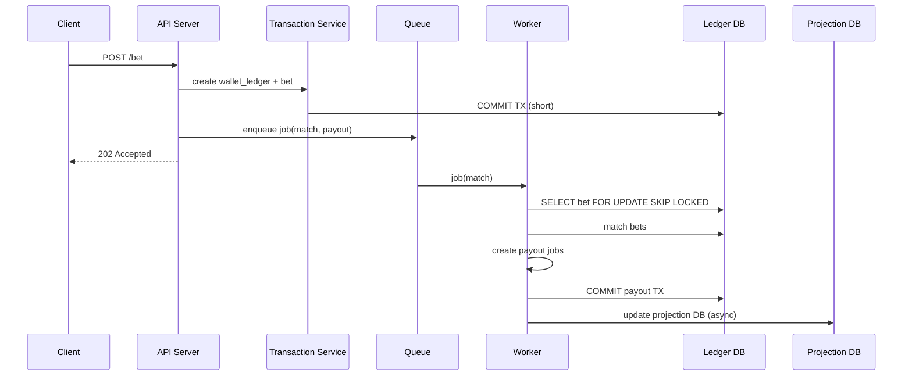

Hoàn toàn có thể, nhưng **cần thiết kế kiến trúc khác hẳn so với 500–1000 users**, vì khi lên **hàng trăm ngàn đến triệu users đồng thời**, các bottleneck sẽ không còn là code đơn lẻ mà là: **DB, network, transaction, queue, money flow, scale worker**.

Mình sẽ phân tích chi tiết cách làm để **hệ thống chịu được triệu user** theo góc nhìn production fintech / exchange:

---

# I️⃣ Kiến trúc nâng cao cho 1 triệu user

## 1️⃣ Layered & Decoupled

```
Client
 ↓
API (Stateless, horizontally scalable)
 ↓
Transaction Service (wallet safe)
 ↓
Outbox / Event Store
 ↓
Queue / Pub-Sub (Redis / Kafka)
 ↓
Worker Pool (Auto-match, Settle)
 ↓
Ledger DB (append-only) + Projection DB (balance)
```

### Giải thích

1. **API Stateless**

* Không giữ state → scale ngang dễ dàng với hàng trăm server
* Load balancer phân tán

2. **Transaction Service tách riêng**

* Chỉ commit ledger / balance
* Giao dịch ngắn → giảm lock DB, tránh deadlock

3. **Outbox / Event Store**

* Event guarantee (không mất job khi crash)
* Worker đọc từ queue / event → idempotent

4. **Queue / Pub-Sub**

* Hàng trăm nghìn job → phân tán giữa nhiều node
* Kafka tốt hơn Redis khi số lượng job cực lớn

5. **Worker Pool**

* Auto-match / settlement tách riêng
* Scale horizontally
* Dùng **row-level lock + SKIP LOCKED** tránh double processing

6. **Ledger append-only**

* Không update balance trực tiếp
* Balance = SUM(ledger) (projection DB) → eventual consistency
* Giống Binance / Coinbase

---

# II️⃣ Database chuẩn cho scale triệu users

## 1. Ledger Table (append-only)

```sql
CREATE TABLE wallet_ledger (
  id BIGSERIAL PRIMARY KEY,
  user_id BIGINT NOT NULL,
  type TEXT NOT NULL, -- DEBIT / CREDIT / REFUND / PAYOUT
  amount BIGINT NOT NULL,
  bet_id BIGINT,
  created_at TIMESTAMP DEFAULT now()
);

CREATE INDEX idx_wallet_ledger_user_created
ON wallet_ledger(user_id, created_at DESC);
```

* Append-only → không update balance
* Scale bằng **partition / sharding** nếu >100M rows

---

## 2. Projection Table (balance)

```sql
CREATE TABLE wallet_balance (
  user_id BIGINT PRIMARY KEY,
  balance BIGINT NOT NULL
);
```

* Chỉ dùng để read / display
* Updated **asynchronously** từ ledger → tránh lock nhiều

---

## 3. Bets Table

```sql
CREATE TABLE bets (
  id BIGSERIAL PRIMARY KEY,
  round_id BIGINT,
  user_id BIGINT,
  amount BIGINT,
  color TEXT,
  status TEXT,
  created_at TIMESTAMP DEFAULT now()
);

CREATE INDEX idx_bets_round_status ON bets(round_id, status);
CREATE INDEX idx_bets_user ON bets(user_id);
```

* Index composite → match nhanh hàng triệu bets

---

# III️⃣ Queue & Worker nâng cao

* **Queue phân tán**: Kafka hoặc BullMQ cluster
* **Worker horizontal scale**: mỗi worker chỉ lấy 1 partition / topic
* **Idempotency key** cho mỗi job: betId / payoutId
* **Retry safe** → không double payout

---

# IV️⃣ Observability & Monitoring

* **Prometheus / Grafana** → latency, job throughput
* **ELK / Loki** → audit trail, debug financial ops
* **Alert**: failed TX, queue backlog

---

# V️⃣ Bottleneck & Giải pháp

| Bottleneck     | Giải pháp                                      |
| -------------- | ---------------------------------------------- |
| DB Lock        | Row-level lock + short TX + ledger append-only |
| Queue Overload | Kafka cluster hoặc BullMQ với sharding         |
| Auto-match     | Worker scale horizontal, SKIP LOCKED           |
| Money Ops      | Idempotent payout/refund, TX riêng             |
| Projection lag | Eventual consistency, read replica             |

---

# VI️⃣ Sequence Diagram – Scale 1M Users



---

# VII️⃣ Tổng kết

✅ Hệ thống triệu user không phải “gồng DB single-node”
✅ Key principles:

1. **Transaction ngắn → DB lock tối thiểu**
2. **Ledger append-only → balance projection**
3. **Queue / worker scale horizontal**
4. **Idempotency + retry safe**
5. **Observability / monitoring**

> Đây là kiến trúc **cốt lõi fintech / crypto exchange** để xử lý **hàng triệu giao dịch đồng thời**.

---

Mình có thể **vẽ thêm Mermaid sequence diagram cho race condition giữa 2 workers + refund case** để bạn thấy rõ cách **tránh double payout trong 1M user**.

Bạn có muốn mình vẽ tiếp không?
