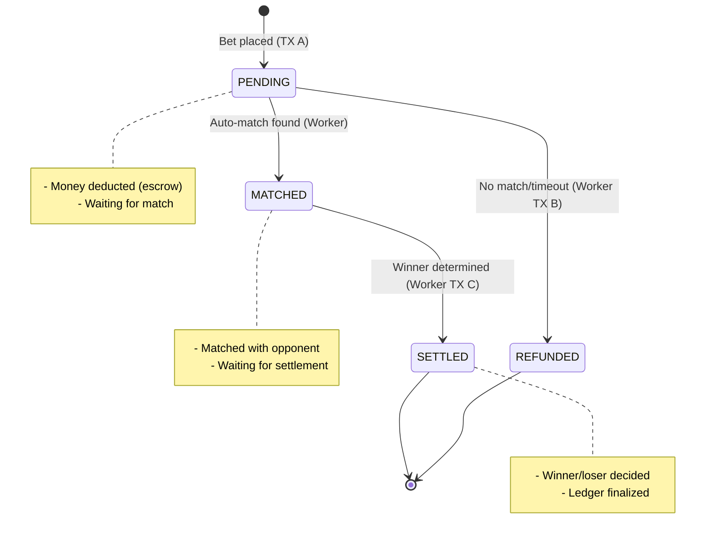

# 📋 ĐÁNH GIÁ VÀ GỢI Ý BỔ SUNG - FULL.MD

## ✅ Những Điểm Mạnh của File Hiện Tại

| Điểm Mạnh | Lý Do |
|-----------|-------|
| ✅ Tư duy Senior | Giải thích đúng cách "tiền = state machine" |
| ✅ Cấu trúc rõ ràng | Từ nguyên tắc vàng → chi tiết → code |
| ✅ Code examples | BullMQ, Transaction, SQL |
| ✅ Practical | Sequence diagram, race condition analysis |
| ✅ Anti-patterns | Rõ ràng ❌ không làm |

---

## ⚠️ Nhược Điểm & Cơ Hội Bổ Sung

### 1️⃣ **Thiếu Visual Diagrams (mermaid/ASCII)**
```
Hiện tại: Chỉ có ASCII text diagram
Cần thêm: Mermaid flowchart (state machine, transaction flow)
```

**Đề xuất:**
```markdown
- Add mermaid state diagram: PENDING → MATCHED → SETTLED / REFUNDED
- Add mermaid sequence: API → TX A → Queue → Worker → TX B/C
- Add mermaid concurrency: Race condition avoidance
```

---

### 2️⃣ **Thiếu Table So Sánh (Dễ Nhớ)**

Hiện tại: Chỉ nói chữ "QueryRunner mới"
Cần: Table so sánh khi nào dùng cái gì

**Đề xuất:**

| Tình Huống | QueryRunner | Transaction | Lock | Idempotent |
|-----------|-----------|----------|------|-----------|
| Place bet (trừ tiền) | ✅ New | ✅ Yes | ✅ FOR UPDATE | ✅ Required |
| Auto-match | ❌ No lock tiền | ✅ Only if atomic update | ✅ SKIP LOCKED | ✅ Status check |
| Refund | ✅ New | ✅ Yes | ✅ FOR UPDATE | ✅ Required |
| Settlement | ✅ New | ✅ Yes | ✅ FOR UPDATE | ✅ Required |

---

### 3️⃣ **Thiếu "Learning Path" (Roadmap Học)**

Hiện tại: Toàn bộ một cục, khó biết học từ đâu
Cần: Phân cấp: Level 1 → 2 → 3

**Đề xuất cấu trúc:**

```
BEGINNER (Hiểu cơ bản)
  ├─ 1. State machine (PENDING → SETTLED)
  ├─ 2. Transaction A (place bet)
  └─ 3. Query runner chuẩn

INTERMEDIATE (Áp dụng)
  ├─ 4. Auto-match worker
  ├─ 5. Refund chuẩn
  ├─ 6. Race condition
  └─ 7. Idempotency

ADVANCED (Production)
  ├─ 8. BullMQ worker (retry/backoff)
  ├─ 9. Reconciliation
  ├─ 10. Monitoring & alerts
  └─ 11. Disaster recovery
```

---

### 4️⃣ **Thiếu "Anti-Patterns Gallery"**

Hiện tại: "TUYỆT ĐỐI KHÔNG LÀM" ở mục 9, nhưng hơi ngắn
Cần: Code example ❌ SAI vs ✅ ĐÚNG

**Đề xuất:**

```markdown
## ❌ ANTI-PATTERN 1: Reuse QueryRunner

❌ SAI:
```ts
const qr = createQueryRunner();
await refund1(qr); // Transaction 1
await qr.commitTransaction();
await refund2(qr); // ❌ Reusing qr!
```

✅ ĐÚNG:
```ts
const qr1 = createQueryRunner();
await refund1(qr1); // Transaction 1
await qr1.commitTransaction();

const qr2 = createQueryRunner(); // ✅ New!
await refund2(qr2); // Transaction 2
```

Hậu quả nếu sai: Race condition → double refund → mất tiền
```

---

### 5️⃣ **Thiếu Code Checklist (Copy-Paste Ready)**

Hiện tại: Code snippet lẻ tẻ
Cần: Complete ready-to-run code

**Đề xuất:**
- [ ] Thêm file `codes/place-bet.ts` (hoàn chỉnh)
- [ ] Thêm file `codes/auto-match-worker.ts` (hoàn chỉnh)
- [ ] Thêm file `codes/refund-worker.ts` (hoàn chỉnh)
- [ ] Thêm file `sql/schema.sql` (hoàn chỉnh)
- [ ] Thêm file `test/stress-test.ts` (hoàn chỉnh)

---

### 6️⃣ **Thiếu "Common Mistakes Interview Questions"**

Hiện tại: Chỉ nói lý thuyết
Cần: Q&A dạng phỏng vấn senior backend

**Đề xuất:**

```markdown
## ❓ Q&A - Senior Backend Interview

Q1: "Tại sao không rollback transaction ban đầu khi refund?"
A: "Vì tiền đã commit là bất biến. Refund là transaction mới dựa trên state machine."

Q2: "Nếu worker crash giữa match và refund thì sao?"
A: "Idempotent key đảm bảo retry an toàn. Status machine tránh double action."

Q3: "Làm sao biết có double payout?"
A: "Chạy SQL: SELECT reference_id, COUNT(*) FROM ledger GROUP BY ref HAVING count > 1"
```

---

### 7️⃣ **Thiếu Performance Metrics**

Hiện tại: Nói "scale" nhưng không nói con số
Cần: Concrete numbers

**Đề xuất:**

```markdown
## 📊 Performance Targets

| Metric | Target | Nếu vượt | Action |
|--------|--------|---------|--------|
| API p99 latency | < 200ms | Tăng lên | Optimize queries, add cache |
| Queue depth | < 1000 | Vượt | Add workers, check DB |
| DB connections | < 80% | Vượt | Scale DB pool |
| Duplicate payouts | = 0 | > 0 | Critical incident |
```

---

### 8️⃣ **Thiếu "Day-by-Day Implementation Plan"**

Hiện tại: Chỉ nói "checklist"
Cần: Cụ thể ngày nào làm cái gì

**Đề xuất:**

```markdown
## 📅 Week 1-2: Implementation Plan

DAY 1:
  ├─ [ ] Set up schema (wallets, bets, ledger, matches)
  ├─ [ ] Create indexes
  └─ [ ] Write unit test for schema

DAY 2:
  ├─ [ ] Implement place-bet API (Transaction A)
  ├─ [ ] Write unit test
  └─ [ ] Manual test with 10 concurrent requests

DAY 3:
  ├─ [ ] Setup BullMQ + Redis
  ├─ [ ] Implement auto-match worker
  └─ [ ] Manual test with queue

...
```

---

## 🎯 Gợi Ý Chỉnh Sửa Cụ Thể

### Issue 1: "Nguyên tắc vàng" quá chung chung

**Hiện tại:**
```markdown
> 🔑 **MỖI LUỒNG TIỀN = 1 TRANSACTION RIÊNG**
```

**Nên sửa thành:**
```markdown
> 🔑 **NGUYÊN TẮC VÀNG: Mỗi thay đổi tiền = 1 Transaction độc lập**
>
> ✅ Áp dụng cho:
> ├─ Bet placement: Transaction A
> ├─ Refund: Transaction B (nếu cần)
> ├─ Settlement: Transaction C (nếu cần)
> └─ Payout: Transaction D (nếu cần)
>
> ❌ Không bao giờ:
> ├─ Gộp chúng vào 1 transaction lớn
> ├─ Reuse QueryRunner sau commit
> └─ Rollback transaction đã commit
```

---

### Issue 2: "State Machine" cần diagram

**Hiện tại:**
```
PENDING → MATCHED → SETTLED
     ↘
       REFUNDED
```

**Nên thêm:**


---

### Issue 3: "Idempotency" cần ví dụ thực tế

**Hiện tại:** Chỉ nói concept
**Nên thêm:** Table so sánh

| Tình Huống | Refund Lần 1 | Refund Lần 2 (Retry) | Kết Quả |
|-----------|-----------|------------|--------|
| ❌ Không idempotent | Balance +100 | Balance +100 | ❌ Total +200 (SAI) |
| ✅ Có idempotent key | INSERT OK | UNIQUE VIOLATION (skip) | ✅ Total +100 (ĐÚNG) |

---

### Issue 4: "Race condition" cần code example

**Hiện tại:** Chỉ giải thích lý thuyết
**Nên thêm:** Code ❌ SAI vs ✅ ĐÚNG

```typescript
// ❌ SAI: 2 workers race condition
async function badAutoMatch(betId: string) {
  const bet = await BetRepo.findOne(betId);
  if (bet.status !== 'PENDING') return;
  
  const opponent = await BetRepo.findOne({
    where: { status: 'PENDING', side: opposite(bet.side) }
  });
  
  // 2 workers cùng find cái opponent này!
  await updateMatch(bet.id, opponent.id);
}

// ✅ ĐÚNG: Pessimistic lock + SKIP LOCKED
async function goodAutoMatch(betId: string) {
  await withTransaction(dataSource, async (manager) => {
    // Lock my bet
    const bet = await manager.findOne(Bet, {
      where: { id: betId },
      lock: { mode: 'pessimistic_write' }
    });
    
    if (bet.status !== 'PENDING') return;
    
    // Find opponent with SKIP LOCKED
    const opponent = await manager.query(`
      SELECT * FROM bets
      WHERE status = 'PENDING' AND side != $1
      FOR UPDATE SKIP LOCKED
      LIMIT 1
    `, [bet.side]);
    
    // Atomic update
    await updateMatch(bet.id, opponent[0].id);
  });
}
```

---

## 🚀 Cải Tiến Chi Tiết (Ready to Implement)

Dưới đây là các cải tiến bạn nên áp dụng vào `full.md`:

### 1. Thêm Table So Sánh (Dễ Nhớ)

```markdown
## 📊 QueryRunner vs Transaction vs Lock – Khi Nào Dùng Cái Gì?

| Thành Phần | Khi Dùng | Ví Dụ | Lưu Ý |
|-----------|---------|-------|--------|
| **QueryRunner** | Mỗi hành động tiền | Bet, Refund, Settle | Phải tạo mới, không reuse |
| **FOR UPDATE** | Lock row khi cần update | Wallet, Bet status | Serializes, use wisely |
| **SKIP LOCKED** | Tìm kiếm row khác khi lock exist | Auto-match opponent | Tránh thundering herd |
| **Idempotent Key** | Tránh double-action | Ledger UNIQUE(key) | DB enforce, không code |
```

---

### 2. Thêm "Learning Milestones"

```markdown
## 🎯 Milestones – Kiểm Tra Học Được Gì

**Milestone 1: Hiểu State Machine**
- [ ] Vẽ được PENDING → MATCHED → SETTLED diagram
- [ ] Giải thích refund không phải rollback

**Milestone 2: Code Transaction**
- [ ] Viết được place-bet (TX A) không lỗi
- [ ] Viết được refund (TX B) với idempotent key

**Milestone 3: Worker Pattern**
- [ ] Hiểu vì sao auto-match không đụng tiền
- [ ] Viết được worker với SKIP LOCKED

**Milestone 4: Production Ready**
- [ ] Viết reconciliation query
- [ ] Đọc được BullMQ config + retry
```

---

### 3. Thêm "Red Flags" (Cảnh Báo)

```markdown
## 🚩 Red Flags – Nếu Thấy Những Điều Này, Có Bug

- [ ] Có `catch (error) { rollback old transaction }`
- [ ] Reuse `QueryRunner` sau `commit`
- [ ] Gộp money op vào `async` work (auto-match)
- [ ] Không có `idempotent_key` trong ledger
- [ ] Balance = `wallet.amount` thay vì `SUM(ledger)`
- [ ] Duplicate payout trong SQL: `SELECT ref, COUNT(*) ... HAVING > 1`
```

---

## 📈 Bổ Sung File Mới (Recommend)

Bạn nên tách thành **4 file** để dễ học:

1. **full.md** - Tổng quan + tư duy (giữ nguyên)
2. **CODE_EXAMPLES.md** - Code ready-to-copy (mới)
3. **ANTI_PATTERNS.md** - ❌ SAI vs ✅ ĐÚNG (mới)
4. **QUICK_REFERENCE.md** - Cheat sheet (mới)

---

## ✅ Tóm Tắt Gợi Ý

| Thứ Tự | Gợi Ý | Mức Độ | Effort |
|--------|------|--------|--------|
| 1️⃣ | Thêm state machine mermaid diagram | 🟢 Easy | 15min |
| 2️⃣ | Thêm table so sánh QueryRunner | 🟢 Easy | 20min |
| 3️⃣ | Thêm ❌ SAI vs ✅ ĐÚNG code examples | 🟡 Medium | 30min |
| 4️⃣ | Thêm "Learning Milestones" checklist | 🟢 Easy | 15min |
| 5️⃣ | Thêm "Red Flags" cảnh báo | 🟢 Easy | 10min |
| 6️⃣ | Tách thành 4 file (full + code + anti + cheat) | 🟡 Medium | 45min |
| 7️⃣ | Thêm interview Q&A | 🟡 Medium | 30min |
| 8️⃣ | Thêm Day-by-day implementation plan | 🟡 Medium | 40min |

---

## 🎓 Kết Luận

**full.md hiện tại: 8/10 điểm**

Ưu điểm:
- ✅ Tư duy Senior đúng
- ✅ Chi tiết, code examples
- ✅ Anti-patterns rõ ràng

Cần cải thiện:
- ⚠️ Thiếu visual (diagram)
- ⚠️ Thiếu "so sánh table" (dễ nhớ)
- ⚠️ Thiếu code examples đầy đủ (ready-to-run)
- ⚠️ Thiếu learning path (dễ học từng bước)

**Sau khi áp dụng gợi ý → 10/10 điểm! 🚀**

---

*Tạo bởi Copilot | 2024*
